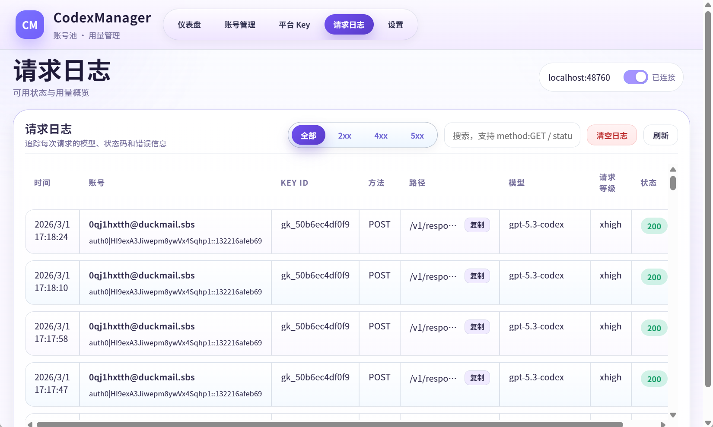
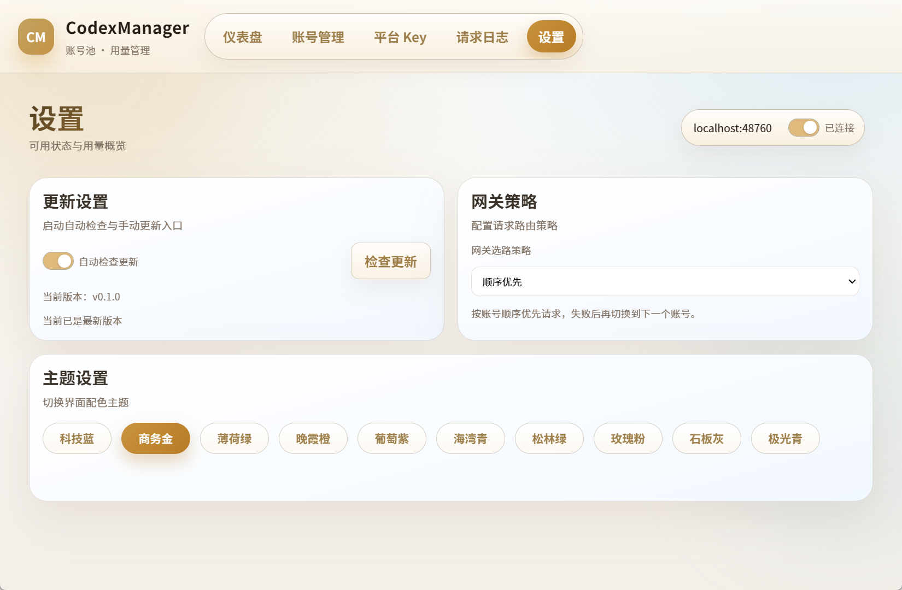

<p align="center">
  
</p>

<h1 align="center">CodexManager</h1>

<p align="center">A local desktop + service toolkit for Codex-compatible account and gateway management.</p>

<p align="center">
  <a href="README.md">中文</a>
</p>

A local desktop + service toolkit for managing a Codex-compatible ChatGPT account pool, usage, and platform keys, with a built-in local gateway.

## Recent Changes
- `v0.1.2` (latest, includes all updates since `v0.1.1`)
- Added Azure OpenAI protocol support: platform keys can now use `azure_openai` with dedicated endpoint configuration and Azure API key authentication flow.
- Added an Azure-specific upstream module (separate files) to keep OpenAI/Anthropic paths stable while introducing protocol-based routing.
- Improved Platform Key modal UX: Azure setup now uses direct `Endpoint + API Key` inputs.
- Improved Request Logs UX: when account info is missing, the account column now falls back to a key-prefix label instead of showing blank.
- Startup speed optimization: startup now uses a local-first load path (accounts/usage/models from local storage first), with model list local cache plus background on-demand refresh (immediate pull when cache is empty, then periodic refresh), significantly reducing first-screen wait time.
- Gateway modular refactor: `gateway` is now organized into `auth/core/request/routing/observability/upstream`, improving maintainability and troubleshooting speed.
- Frontend interaction improvements: noticeable lag reduction in Accounts and Request Logs; refresh tasks now have a shared concurrency cap; added a unified request wrapper (`timeout/retry/cancel`) for better weak-network stability.
- Refresh UX upgrade: “Refresh All” now shows progress (completed/remaining) with stable busy-state handling to avoid “clicked but no feedback” perception.
- Account import enhancement: large-batch imports are processed in chunks; default import group is `IMPORT`; empty group values are auto-filled.
- Usage status unification: backend now exposes a unified availability enum and frontend maps it to consistent labels (`Available / Single-window available / Unavailable / Unknown`).
- Request logs responsive optimization: narrow screens hide secondary columns by priority while preserving core fields (account/path/model/status).
- Button and layout consistency: unified sizing for page buttons, row action buttons, and modal buttons; Accounts and Dashboard content widths are aligned.
- Gateway observability: capped `http_bridge` output accumulation; added `/metrics` to expose DB busy, HTTP queue depth, upstream attempt latency, etc.
- Release flow speed & safety: manual-only workflows across platforms; unified Tauri CLI version; tag/version consistency checks; release assets include `SHA256SUMS`/`manifest.json`; upload-artifact compression disabled; concurrency is scoped by `workflow+tag` to avoid cross-workflow cancellations; release-create races automatically fall back to `edit + upload`.

## Features
- Account pool management: group, tag, sort, note
- Usage dashboard: supports 5-hour + 7-day dual windows, and accounts that only return a 7-day single window (for example free weekly quota)
- OAuth login: browser flow + manual callback parsing
- Platform keys: create, disable, delete, bind model
- Local service: auto-start with configurable port
- Local gateway: OpenAI-compatible entry for CLI/tools

## Screenshots





## Tech Stack
- Frontend: Vite + vanilla JavaScript
- Desktop: Tauri (Rust)
- Service: Rust (local HTTP/RPC + Gateway)

## Project Structure
```text
.
├─ apps/                # Frontend + Tauri desktop app
│  ├─ src/
│  ├─ src-tauri/
│  └─ dist/
├─ crates/              # Rust core/service
│  ├─ core
│  ├─ service
│  ├─ start              # Service edition starter (launches service + web)
│  └─ web                # Service edition Web UI (optional embedded assets + /api/rpc proxy)
├─ scripts/             # build/release scripts
├─ portable/            # portable output
└─ README.en.md
```

## Quick Start
1. Launch desktop app and click "Start Service".
2. Add accounts in Account Management and finish OAuth.
3. If callback fails, paste callback URL into manual parser.
4. Refresh usage and verify account status.

## Service Edition (Headless service + Web UI, no desktop runtime)
1. Download `CodexManager-service-<platform>-<arch>.zip` from the Release page and unzip.
2. Recommended: start `codexmanager-start` (one process that launches both service + web, and you can Ctrl+C to stop).
3. You can also start `codexmanager-web` directly (it will auto-spawn `codexmanager-service` from the same directory and open the browser).
4. Or start `codexmanager-service` first (shows console logs), then start `codexmanager-web`.
5. Default addresses: service `localhost:48760`, Web UI `http://localhost:48761/`.
6. Quit: open `http://localhost:48761/__quit` (stops web; if web auto-spawned the service, it will try to stop the service as well).

## Docker Deployment
### Option 1: docker compose (Recommended)
```bash
docker compose -f docker/docker-compose.yml up --build
```
Open in browser: `http://localhost:48761/`

### Option 2: Build/Run separately
```bash
# service
docker build -f docker/Dockerfile.service -t codexmanager-service .
docker run --rm -p 48760:48760 -v codexmanager-data:/data \
  -e CODEXMANAGER_RPC_TOKEN=replace_with_your_token \
  codexmanager-service

# web (must reach the service)
docker build -f docker/Dockerfile.web -t codexmanager-web .
docker run --rm -p 48761:48761 \
  -e CODEXMANAGER_WEB_NO_SPAWN_SERVICE=1 \
  -e CODEXMANAGER_SERVICE_ADDR=host.docker.internal:48760 \
  -e CODEXMANAGER_RPC_TOKEN=replace_with_your_token \
  codexmanager-web
```

## Development & Build
### Frontend
```bash
pnpm -C apps install
pnpm -C apps run dev
pnpm -C apps run test
pnpm -C apps run test:ui
pnpm -C apps run build
```

### Rust
```bash
cargo test --workspace
cargo build -p codexmanager-service --release
cargo build -p codexmanager-web --release
cargo build -p codexmanager-start --release

# Release/containers: embed frontend assets into codexmanager-web (single binary)
pnpm -C apps run build
cargo build -p codexmanager-web --release --features embedded-ui
```

### Tauri Packaging (Windows)
```powershell
pwsh -NoLogo -NoProfile -File scripts/rebuild.ps1 -Bundle nsis -CleanDist -Portable
```

### Tauri Packaging (Linux/macOS)
```bash
./scripts/rebuild-linux.sh --bundles "appimage,deb" --clean-dist
./scripts/rebuild-macos.sh --bundles "dmg" --clean-dist
```

## GitHub Actions (Manual Only)
All workflows are `workflow_dispatch` only.

- `ci-verify.yml`
  - Purpose: quality gate (Rust tests + frontend tests + frontend build)
  - Trigger: manual only
- `release-windows.yml`
  - Purpose: Windows packaging and release publishing (installer + portable)
  - Trigger: manual only
  - Inputs:
    - `tag` (required)
    - `ref` (default: `main`)
    - `run_verify` (default: `true`)
- `release-linux.yml`
  - Purpose: Linux packaging and release publishing (AppImage/deb/rpm + portable)
  - Trigger: manual only
  - Inputs:
    - `tag` (required)
    - `ref` (default: `main`)
    - `run_verify` (default: `true`)
- `release-macos-beta.yml`
  - Purpose: macOS beta release (unsigned, for internal testing only)
  - Trigger: manual only
  - Inputs:
    - `tag` (required)
    - `ref` (default: `main`)
    - `run_verify` (default: `true`)
- `release-service-windows.yml`
  - Purpose: Windows Service edition packaging and release publishing (zip)
  - Trigger: manual only
  - Inputs:
    - `tag` (required)
    - `ref` (default: `main`)
    - `run_verify` (default: `true`)
- `release-service-linux.yml`
  - Purpose: Linux Service edition packaging and release publishing (zip)
  - Trigger: manual only
  - Inputs:
    - `tag` (required)
    - `ref` (default: `main`)
    - `run_verify` (default: `true`)
- `release-service-macos.yml`
  - Purpose: macOS Service edition packaging and release publishing (zip)
  - Trigger: manual only
  - Inputs:
    - `tag` (required)
    - `ref` (default: `main`)
    - `run_verify` (default: `true`)

## Script Reference
### `scripts/rebuild.ps1` (Windows)
Primarily for local Windows packaging. `-AllPlatforms` mode dispatches GitHub workflow.

Examples:
```powershell
# Local Windows build
pwsh -NoLogo -NoProfile -File scripts/rebuild.ps1 -Bundle nsis -CleanDist -Portable

# Dispatch a release workflow (and download artifacts)
pwsh -NoLogo -NoProfile -File scripts/rebuild.ps1 `
  -AllPlatforms `
  -GitRef main `
  -ReleaseTag v0.0.9 `
  -GithubToken <token> `
  -WorkflowFile release-windows.yml

# Skip verify gate inside release workflow
pwsh -NoLogo -NoProfile -File scripts/rebuild.ps1 `
  -AllPlatforms -GitRef main -ReleaseTag v0.0.9 -GithubToken <token> -NoVerify -WorkflowFile release-windows.yml
```

Parameters (with defaults):
- `-Bundle nsis|msi`: default `nsis`
- `-NoBundle`: compile only, no installer bundle
- `-CleanDist`: clean `apps/dist` before build
- `-Portable`: also stage portable output
- `-PortableDir <path>`: portable output dir, default `portable/`
- `-AllPlatforms`: dispatch the selected release workflow (`-WorkflowFile`)
- `-GithubToken <token>`: GitHub token; falls back to `GITHUB_TOKEN`/`GH_TOKEN`
- `-WorkflowFile <name>`: choose one of `release-windows.yml` / `release-linux.yml` / `release-macos-beta.yml`
- `-GitRef <ref>`: workflow ref; defaults to current branch or current tag
- `-ReleaseTag <tag>`: release tag; strongly recommended in `-AllPlatforms`
- `-NoVerify`: sets workflow input `run_verify=false`
- `-DownloadArtifacts <bool>`: default `true`
- `-ArtifactsDir <path>`: artifact download dir, default `artifacts/`
- `-PollIntervalSec <n>`: polling interval, default `10`
- `-TimeoutMin <n>`: timeout minutes, default `60`
- `-DryRun`: print plan only

### `scripts/bump-version.ps1` (Unified Version Bump)
Use this to bump release version in one command instead of editing multiple files manually.

```powershell
pwsh -NoLogo -NoProfile -File scripts/bump-version.ps1 -Version 0.1.3
```

It updates:
- root `Cargo.toml` workspace version
- `apps/src-tauri/Cargo.toml`
- `apps/src-tauri/tauri.conf.json`

## Environment Variables
### Load Rules and Precedence
- Desktop / `codexmanager-service` / `codexmanager-web` load env files from executable directory in this order:
  - `codexmanager.env` -> `CodexManager.env` -> `.env` (first hit wins)
- Existing process/system env vars are not overridden by env-file values.
- Most vars are optional. If the run directory is not writable (for example an install directory), set `CODEXMANAGER_DB_PATH` to a writable path.
- The tables below are split into common vs advanced knobs. For the full list, search `CODEXMANAGER_` in the source code as the source of truth.

### Common Variables (`CODEXMANAGER_*`)
| Variable | Default | Description |
|---|---|---|
| `CODEXMANAGER_SERVICE_ADDR` | `localhost:48760` | Service bind address and default RPC target used by desktop app. |
| `CODEXMANAGER_WEB_ADDR` | `localhost:48761` | Service edition Web UI bind address (used by `codexmanager-web` only). |
| `CODEXMANAGER_WEB_ROOT` | `web/` next to executable | Web static assets directory (used by `codexmanager-web` only; not needed when using embedded UI assets). |
| `CODEXMANAGER_WEB_NO_OPEN` | Unset | If set, `codexmanager-web` will not auto-open the browser. |
| `CODEXMANAGER_WEB_NO_SPAWN_SERVICE` | Unset | If set, `codexmanager-web` will not try to auto-spawn `codexmanager-service` from the same directory. |
| `CODEXMANAGER_DB_PATH` | `codexmanager.db` next to executable (Service/Web); desktop auto-sets | SQLite path. Desktop sets `app_data_dir/codexmanager.db`. |
| `CODEXMANAGER_RPC_TOKEN` | Auto-generated random 64-hex string | `/rpc` auth token. Auto-generated if missing, and persisted to `codexmanager.rpc-token` by default for cross-process reuse. |
| `CODEXMANAGER_RPC_TOKEN_FILE` | `codexmanager.rpc-token` next to DB | Custom `/rpc` token file path (relative paths are resolved from DB directory). |
| `CODEXMANAGER_NO_SERVICE` | Unset | If present (any value), desktop app does not auto-start embedded service. |
| `CODEXMANAGER_ISSUER` | `https://auth.openai.com` | OAuth issuer. |
| `CODEXMANAGER_CLIENT_ID` | `app_EMoamEEZ73f0CkXaXp7hrann` | OAuth client id. |
| `CODEXMANAGER_ORIGINATOR` | `codex_cli_rs` | OAuth authorize `originator` value. |
| `CODEXMANAGER_REDIRECT_URI` | `http://localhost:1455/auth/callback` (or dynamic login-server port) | OAuth redirect URI. |
| `CODEXMANAGER_LOGIN_ADDR` | `localhost:1455` | Local login callback listener address. |
| `CODEXMANAGER_ALLOW_NON_LOOPBACK_LOGIN_ADDR` | `false` | Allows non-loopback login callback address when set to `1/true/TRUE/yes/YES`. |
| `CODEXMANAGER_USAGE_BASE_URL` | `https://chatgpt.com` | Base URL for usage requests. |
| `CODEXMANAGER_DISABLE_POLLING` | Unset (polling enabled) | If present (any value), disables usage polling thread. |
| `CODEXMANAGER_USAGE_POLL_INTERVAL_SECS` | `600` | Usage polling interval in seconds, minimum `30`. Invalid values fall back to default. |
| `CODEXMANAGER_GATEWAY_KEEPALIVE_INTERVAL_SECS` | `180` | Gateway keepalive interval in seconds, minimum `30`. |
| `CODEXMANAGER_UPSTREAM_BASE_URL` | `https://chatgpt.com/backend-api/codex` | Primary upstream base URL. Bare ChatGPT host values are normalized to backend-api/codex. |
| `CODEXMANAGER_UPSTREAM_FALLBACK_BASE_URL` | Auto-inferred | Explicit fallback upstream. If unset and primary is ChatGPT backend, fallback defaults to `https://api.openai.com/v1`. |
| `CODEXMANAGER_UPSTREAM_COOKIE` | Unset | Upstream Cookie, mainly for Cloudflare/WAF challenge scenarios. |
| `CODEXMANAGER_ROUTE_STRATEGY` | `ordered` | Gateway account routing strategy: default `ordered` (follow account order, fail over to next on failure); set `balanced`/`round_robin`/`rr` to enable key+model-based balanced round-robin starts. |
| `CODEXMANAGER_UPSTREAM_CONNECT_TIMEOUT_SECS` | `15` | Upstream connect timeout in seconds. |
| `CODEXMANAGER_UPSTREAM_TOTAL_TIMEOUT_MS` | `120000` | Upstream total timeout per request in milliseconds. Set `0` to disable. |
| `CODEXMANAGER_UPSTREAM_STREAM_TIMEOUT_MS` | `300000` | Upstream stream timeout in milliseconds. Set `0` to disable. |
| `CODEXMANAGER_PROXY_LIST` | Unset | Upstream proxy pool (max 5 entries, separated by comma/semicolon/newlines). Each account is stably hash-mapped to one proxy to avoid proxy drift. |
| `CODEXMANAGER_REQUEST_GATE_WAIT_TIMEOUT_MS` | `300` | Request-gate wait budget in milliseconds. |
| `CODEXMANAGER_ACCOUNT_MAX_INFLIGHT` | `0` | Per-account soft inflight cap. `0` means unlimited. |
| `CODEXMANAGER_TRACE_BODY_PREVIEW_MAX_BYTES` | `0` | Max bytes for trace body preview. `0` disables body preview. |
| `CODEXMANAGER_FRONT_PROXY_MAX_BODY_BYTES` | `16777216` | Max accepted request body size for front proxy (16 MiB default). |
| `CODEXMANAGER_HTTP_WORKER_FACTOR` | `4` | Backend worker factor; workers = `max(cpu * factor, worker_min)`. |
| `CODEXMANAGER_HTTP_WORKER_MIN` | `8` | Minimum backend workers. |
| `CODEXMANAGER_HTTP_QUEUE_FACTOR` | `4` | Backend queue factor; queue = `max(worker * factor, queue_min)`. |
| `CODEXMANAGER_HTTP_QUEUE_MIN` | `32` | Minimum backend queue size. |

### Advanced Variables (Optional)
| Variable | Default | Description |
|---|---|---|
| `CODEXMANAGER_ACCOUNT_IMPORT_BATCH_SIZE` | `200` | Import batch size for auth.json bulk imports. |
| `CODEXMANAGER_TRACE_QUEUE_CAPACITY` | `2048` | Gateway trace async queue capacity (too small may drop traces; too large may increase memory). |
| `CODEXMANAGER_HTTP_STREAM_WORKER_FACTOR` | `1` | Backend stream worker factor (SSE/long-lived responses). |
| `CODEXMANAGER_HTTP_STREAM_WORKER_MIN` | `2` | Minimum backend stream workers. |
| `CODEXMANAGER_HTTP_STREAM_QUEUE_FACTOR` | `2` | Backend stream queue factor. |
| `CODEXMANAGER_HTTP_STREAM_QUEUE_MIN` | `16` | Minimum backend stream queue size. |
| `CODEXMANAGER_POLL_JITTER_SECS` | Unset | Common polling jitter in seconds; can be overridden by module-specific jitter envs. |
| `CODEXMANAGER_POLL_FAILURE_BACKOFF_MAX_SECS` | Unset | Common failure backoff cap in seconds; can be overridden by module-specific backoff envs. |
| `CODEXMANAGER_USAGE_POLL_JITTER_SECS` | `5` | Usage polling jitter in seconds. |
| `CODEXMANAGER_USAGE_POLL_FAILURE_BACKOFF_MAX_SECS` | `1800` | Usage polling failure backoff cap in seconds. |
| `CODEXMANAGER_USAGE_REFRESH_WORKERS` | `4` | Usage refresh worker count. |
| `CODEXMANAGER_GATEWAY_KEEPALIVE_JITTER_SECS` | `5` | Keepalive jitter in seconds. |
| `CODEXMANAGER_GATEWAY_KEEPALIVE_FAILURE_BACKOFF_MAX_SECS` | `900` | Keepalive failure backoff cap in seconds. |
| `CODEXMANAGER_USAGE_REFRESH_FAILURE_EVENT_WINDOW_SECS` | `60` | Dedupe window (seconds) for inserting usage refresh failure events, to avoid spamming the event table on transient failures. |
| `CODEXMANAGER_USAGE_SNAPSHOTS_RETAIN_PER_ACCOUNT` | `200` | Usage snapshots retained per account (0 disables pruning). |
| `CODEXMANAGER_CANDIDATE_CACHE_TTL_MS` | `500` | Gateway candidate snapshot cache TTL in ms (reduces DB pressure on high-QPS). Set `0` to disable. |
| `CODEXMANAGER_PROMPT_CACHE_TTL_SECS` | `3600` | Prompt cache TTL in seconds. |
| `CODEXMANAGER_PROMPT_CACHE_CLEANUP_INTERVAL_SECS` | `60` | Prompt cache cleanup interval in seconds. |
| `CODEXMANAGER_PROMPT_CACHE_CAPACITY` | `4096` | Prompt cache capacity (0 disables capacity limit). |
| `CODEXMANAGER_HTTP_BRIDGE_OUTPUT_TEXT_LIMIT_BYTES` | `131072` | Cap accumulated `output_text` bytes extracted from upstream responses (0 disables limit). |
| `CODEXMANAGER_ROUTE_HEALTH_P2C_ENABLED` | `true` | Enable candidate health-based P2C (Power of Two Choices) routing. |
| `CODEXMANAGER_ROUTE_HEALTH_P2C_ORDERED_WINDOW` | `3` | P2C window size in `ordered` mode. |
| `CODEXMANAGER_ROUTE_HEALTH_P2C_BALANCED_WINDOW` | `6` | P2C window size in `balanced` mode. |
| `CODEXMANAGER_ROUTE_STATE_TTL_SECS` | `21600` | Route-state TTL in seconds to cap key/model state growth. |
| `CODEXMANAGER_ROUTE_STATE_CAPACITY` | `4096` | Route-state capacity cap. |
| `CODEXMANAGER_UPDATE_REPO` | `qxcnm/Codex-Manager` | GitHub repo (`owner/name`) used by the in-app updater. |
| `CODEXMANAGER_GITHUB_TOKEN` | Unset | GitHub token for in-app one-click update (falls back to `GITHUB_TOKEN`/`GH_TOKEN`). Leaving it unset may hit API rate limits and degrade asset metadata lookup. |

### Release-Script Related Variables
| Variable | Default | Required | Description |
|---|---|---|---|
| `GITHUB_TOKEN` | None | Conditionally required | Required for `rebuild.ps1 -AllPlatforms` when `-GithubToken` is not passed. |
| `GH_TOKEN` | None | Conditionally required | Fallback token variable equivalent to `GITHUB_TOKEN`. |

## Env File Example (next to executable)
```dotenv
# codexmanager.env / CodexManager.env / .env
CODEXMANAGER_SERVICE_ADDR=localhost:48760
CODEXMANAGER_WEB_ADDR=localhost:48761
CODEXMANAGER_UPSTREAM_BASE_URL=https://chatgpt.com/backend-api/codex
CODEXMANAGER_USAGE_POLL_INTERVAL_SECS=600
CODEXMANAGER_GATEWAY_KEEPALIVE_INTERVAL_SECS=180
# Optional: fixed RPC token for external clients
# CODEXMANAGER_RPC_TOKEN=replace_with_your_static_token
```

Notes:
- Env files are loaded **once when the desktop/service/web process starts**. After editing the file, restart the corresponding process for changes to take effect.
- The desktop app persists the service port in local storage; env vars mainly affect the initial default value (to force-reset, change it in UI or clear local storage and relaunch).
- Env-file values only apply to variables that are not already defined in the current process. If you set the same `CODEXMANAGER_*` in system/user env vars, those take precedence.

## Troubleshooting
- OAuth callback failures: check `CODEXMANAGER_LOGIN_ADDR` conflicts, or use manual callback parsing in UI.
- Model list/request blocked by challenge: try `CODEXMANAGER_UPSTREAM_COOKIE` or explicit `CODEXMANAGER_UPSTREAM_FALLBACK_BASE_URL`.
- Standalone service/Web: if the run directory is not writable, set `CODEXMANAGER_DB_PATH` to a writable path.
- macOS with a system proxy: ensure loopback requests (`localhost/127.0.0.1`) are `DIRECT`, and use lowercase `localhost:<port>` (for example `localhost:48760`).

## Account Hit Rules 
- In `ordered` mode, gateway candidates are built and attempted by account `sort` ascending (for example `0 -> 1 -> 2 -> 3`).
- This means "try in order", not "always hit account 0". If an earlier account is unavailable/fails, gateway automatically falls through to the next one.
- Common reasons an earlier account is not hit:
  - account status is not `active`
  - token record is missing
  - usage availability check marks it unavailable (for example primary window exhausted or required usage fields missing)
  - account is skipped by cooldown or soft inflight cap
- In `balanced` mode, the start candidate rotates by `Key + model`, so attempts do not necessarily start from the smallest `sort`.
- For diagnosis, check `gateway-trace.log` in the same directory as the database:
  - `CANDIDATE_POOL`: candidate order for this request
  - `CANDIDATE_START` / `CANDIDATE_SKIP`: actual attempt and skip reason
  - `REQUEST_FINAL`: final account selected

## 🤝 Special Thanks
This project references the following open-source project for gateway protocol adaptation and stability hardening ideas:

- [CLIProxyAPI](https://github.com/router-for-me/CLIProxyAPI)

Related implementation points:
- `crates/service/src/gateway/protocol_adapter/request_mapping.rs`
- `crates/service/src/gateway/upstream/transport.rs`

## Contact


