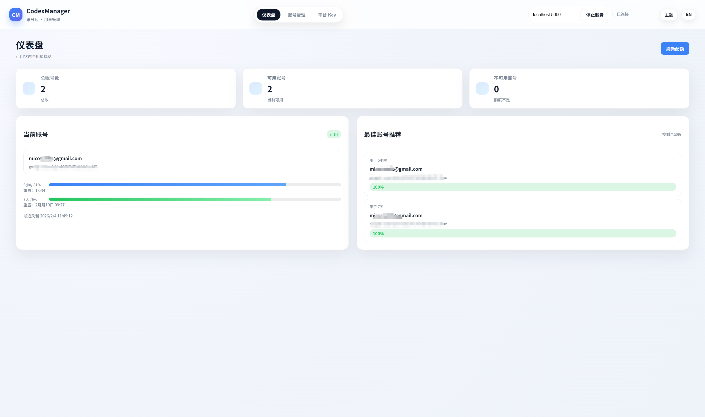
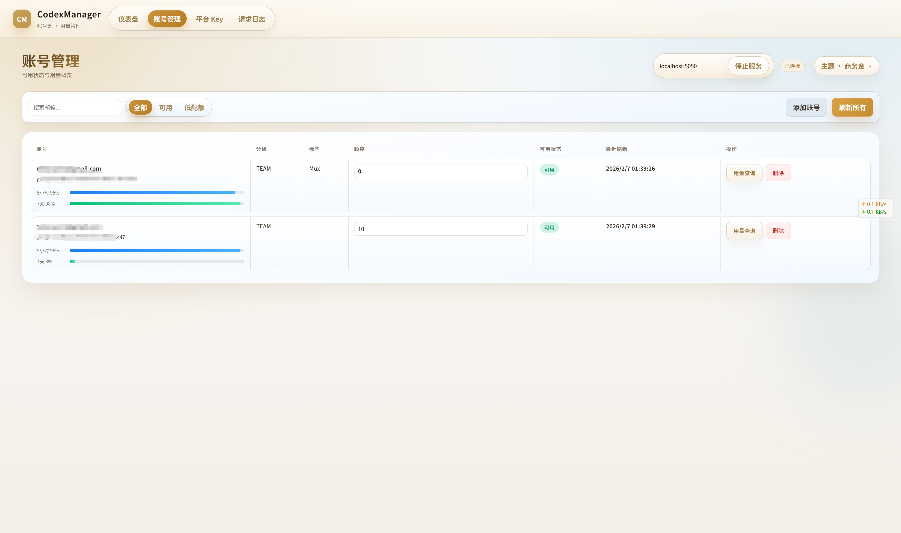
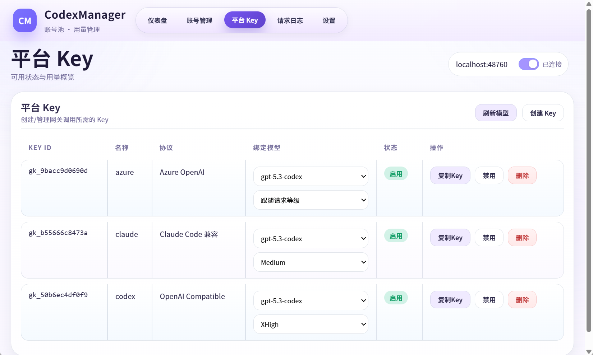

# CodexManager

本地桌面端 + 服务进程的 Codex 账号池管理器，用于统一管理账号、用量与平台 Key，并提供本地网关与服务能力。

[English](README.en.md)

## 项目简介
- 桌面端（Tauri）负责账号管理、用量展示、授权登录与平台 Key 配置
- 服务端（Rust）提供本地 RPC + Gateway，支持用量刷新、账号轮询与鉴权转发
- 支持手动解析 OAuth 回调链接，避免端口冲突或回调失败

## 功能亮点
- 账号池管理：分组/标签/排序/备注
- 用量展示：5 小时 + 7 日用量快照
- 授权登录：浏览器授权 + 手动回调解析
- 平台 Key：生成/禁用/删除
- 本地服务：自动启动、可自定义端口
- 网关能力：为本地 CLI/工具提供统一入口

## 截图
> GitHub 可直接预览





## 技术栈
- 前端：Vite + 原生 JS + 自定义 UI
- 桌面端：Tauri (Rust)
- 服务端：Rust（本地 HTTP/RPC + Gateway）

## 目录结构
```
.
├─ apps/                # 前端与 Tauri 桌面端
│  ├─ src/              # 前端源码
│  ├─ src-tauri/        # Tauri 端源码
│  └─ dist/             # 前端构建产物
├─ crates/              # Rust 核心与服务端
│  ├─ gpttools-core
│  └─ gpttools-service
├─ portable/            # 便携版输出目录
├─ rebuild.ps1          # 打包脚本
└─ README.md
```

## 快速开始
1. 启动桌面端后，点击“启动服务”
2. 进入“账号管理”添加账号并完成授权
3. 需要时粘贴回调链接完成手动解析
4. 刷新用量，检查状态与配额

## 开发与构建
### 前端开发
```
pnpm run dev
```

### 构建前端
```
pnpm run build
```

### Rust（service）单独构建
本项目的 service 可单独编译（用于调试、替换或嵌入桌面端）。

```
cargo build -p gpttools-service --release
```

产物默认在：
- `target/release/gpttools-service.exe`

### Tauri 打包
```
.\rebuild.ps1 -Bundle nsis -CleanDist -Portable
```

### 产物说明
- 安装包（nsis/msi）：`apps/src-tauri/target/release/bundle/`
- 便携版：`portable/`

## 常见问题
- 授权回调失败：可手动粘贴回调链接解析
- 端口被占用：修改顶部端口输入框后重新启动服务
- 用量查询失败：稍后重试，或检查服务状态与网络

## 联系我们


